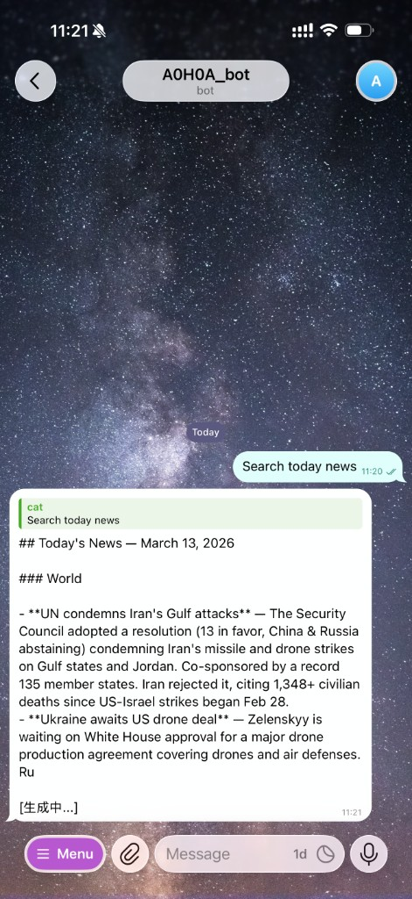
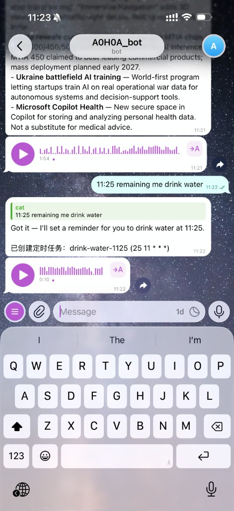
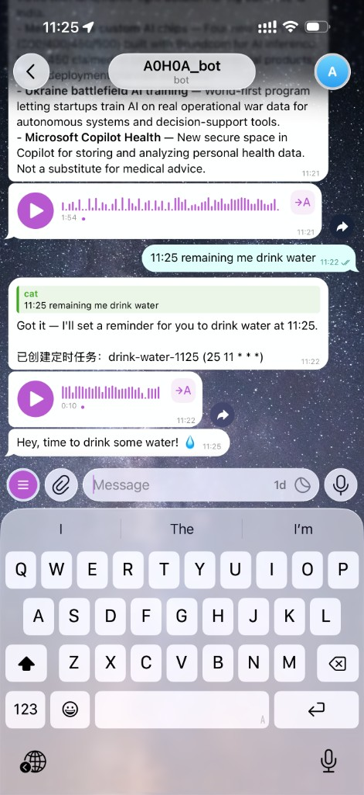

# 2026 AI Agent 生态：从 OpenClaw 到 NanoBot，我为什么选择造一座桥

> Cursor、Claude Code、Codex、Gemini CLI——2026 年的 AI 编程工具多到让人焦虑。每个都很强，每个都想成为你的唯一入口。但真正的问题不是"哪个最强"，而是"我在这些工具上的投入，能不能不白费"。

---

## 一、Agent 平台之争

### OpenClaw：全能型重装平台

[OpenClaw](https://docs.openclaw.ai/) 是 2026 年 AI Agent 领域的标杆级项目。43 万行 TypeScript，它几乎什么都做了：

- **AGENTS.md 系统**——项目级的 Agent 知识库。一个 Markdown 文件承载项目的架构、约定、踩坑记录，每次会话自动加载。嵌入式上下文的成功率是 100%，而让 Agent 自行查找只有 53%。这个发现影响了整个行业。
- **多 Agent 路由**——根据任务类型自动分配给不同 Agent，每个 Agent 有专属工具集和权限。
- **ClawHub 技能市场**——社区共享的 Agent Skills，类似 npm 之于 Node.js。
- **容器隔离（NanoClaw）**——每个 Agent 运行在独立容器里，文件系统和网络完全隔离。

OpenClaw 的设计哲学是**大一统**——它想成为 Agent 的操作系统，所有工具、所有模型、所有工作流都在它的框架内运行。

**优点：** 功能最全，生态最大，安全模型最完善。

**代价：** 43 万行代码意味着高学习曲线。自行管理 API Key，按模型提供商计费。配置格式（`AGENTS.md` + `.agents.local.md`）是 OpenClaw 专属的——你在 Cursor 里的 Rules 和 Hooks 用不上，得重新写一套。

### NanoBot：极简主义的反叛

[NanoBot](https://nanobot.club/) 是香港大学 HKUDS 实验室的作品，2026 年 2 月发布，迅速拿到 3 万+ GitHub Stars。它的卖点是一个字：**小**。

- **4000 行 Python**——OpenClaw 的百分之一。整个代码库一个小时能审完。
- **9 个消息平台**——Telegram、Discord、WhatsApp、Slack、飞书、钉钉、QQ、邮件、Mochat，开箱即用。
- **11+ 个模型提供商**——OpenRouter、Anthropic、OpenAI、DeepSeek、Gemini、Groq、vLLM（本地模型）……你想用哪个用哪个。
- **MEMORY.md + 每日笔记**——和 OpenClaw 类似的记忆系统，但更轻量。
- **定时任务**——基于 apscheduler 的 cron 系统。
- **MCP 支持**——可以接入 Model Context Protocol 工具。

NanoBot 的设计哲学是**够用就好**——用最少的代码实现 OpenClaw 的核心能力。对于研究者和想要完全掌控代码的开发者来说，这非常有吸引力。

**优点：** 极轻量，平台覆盖广，pip install 即用，代码完全可审计。

**代价：** 轻量也意味着工具集有限——文件操作、终端、Web 访问、MCP，基本够用但不如 Cursor 丰富。没有 Hooks 系统。自行管理 API Key。配置格式同样是 NanoBot 专属的。

### 它们的共同问题

OpenClaw 和 NanoBot 都很出色，但它们有一个共同的假设：**你愿意从零开始配置一个新的 Agent 环境。**

如果你已经在 Cursor IDE 里花了几周时间——精心写了 Rules、配好了 Hooks、调试了 MCP 服务器、积累了 Skills、建立了记忆文件——这些投入怎么办？

```
Cursor IDE 里的你：
  .cursor/rules/agents.mdc     ← 项目知识（花了 2 小时写的）
  .cursor/rules/soul.mdc       ← Agent 人格（调了 3 天才满意）
  .cursor/hooks.json            ← 6 个 hook 脚本
  .cursor/mcp.json              ← 4 个 MCP 服务器
  ~/.cursor/skills/             ← 12 个全局 Skills
  memory/MEMORY.md              ← 积累了 2 个月的项目知识

切换到 NanoBot 或 OpenClaw：
  以上全部作废。从零开始。
```

---

## 二、另一种思路：不造 Agent，造桥

这就是 CursorClaw 的出发点。

**CursorClaw 不是一个新的 Agent 平台。它是一座桥——把你已经投入的 Cursor 生态，延伸到 IDE 之外的任何地方。**

```
你（手机 Telegram）: 帮我把 src/utils.js 的 dayjs 换成 date-fns
    ↓
CursorClaw Bridge（你的服务器上跑着的一个 Node.js 进程）
    ↓
Cursor Agent（通过 ACP 协议启动的子进程）
    → 自动加载你的 .cursor/rules/*.mdc
    → 自动加载你的 .cursor/hooks.json
    → 自动连接你的 MCP 服务器
    → 自动使用你的 ~/.cursor/skills/
    → 读文件 → 搜索 → 替换 → 跑测试
    ↓
你（手机 Telegram）: 收到流式回复 "已替换 3 个文件，测试通过 ✓"
```

关键词是**自动加载**。你在 IDE 里配过什么，Bridge 里就有什么。零迁移成本。

<p align="center">
  
  &nbsp;&nbsp;
  
  &nbsp;&nbsp;
  
</p>
<p align="center">
  <em>左：流式回复 + MCP 搜索 ｜ 中：创建定时任务 + 语音 ｜ 右：定时任务按时触发</em>
</p>

---

## 三、CursorClaw 做了什么

### 3 分钟配置

```bash
git clone https://github.com/c4bbage/CursorClaw.git
cd CursorClaw
bash setup-claw.sh --bridge   # 安装规则 + hooks + 记忆 + npm 依赖 + .env
# 编辑 .env，填入 Bot Token
npm start                      # 飞书
npm run start:telegram         # Telegram
```

四步。不需要学新的配置格式，不需要管理 API Key（用 Cursor 订阅），不需要重写规则。

### 核心能力

| 能力 | 说明 |
|---|---|
| **多渠道** | 飞书 + Telegram，统一适配器接口 |
| **流式回复** | Agent 生成时实时更新消息，不用等全部完成 |
| **语音交互** | 语音输入自动转写（ElevenLabs STT），`/voice` 开启语音回复（TTS） |
| **Hooks 兼容** | 17/18 个 Cursor hook 事件在 ACP 模式下完整工作 |
| **Rules & Skills** | `.cursor/rules/*.mdc`、`AGENTS.md`、全局 Skills 自动加载 |
| **会话隔离** | 按 `channel:conversation:user` 隔离，多用户互不干扰 |
| **定时任务** | Agent 可以创建 cron 任务，主动推送结果 |
| **跨会话记忆** | Hooks 在会话启动时注入 `memory/MEMORY.md` 和每日日志 |
| **权限控制** | 环境变量配置用户/群组白名单 |
| **命令菜单** | `/help`、`/cancel`、`/status`、`/memory`、`/clear`、`/tasks`、`/voice` |

### Hooks：最重要的技术细节

Cursor IDE 的 [Hooks](https://docs.cursor.com/context/hooks) 是一个被严重低估的能力——它让你在 Agent 的生命周期事件上挂载自定义脚本。比如：

- `sessionStart` → 注入记忆文件
- `preToolUse` → 拦截危险操作
- `postToolUse` → 记录工具调用日志
- `stop` → 会话结束时写摘要到每日日志

问题是：Hooks 只在 IDE 里生效。Cursor 的 `agent acp` CLI 不会触发它们。

**CursorClaw 的 HookRunner 解决了这个问题。** 它读取 `.cursor/hooks.json`，在 ACP 桥接的等效生命周期节点触发相同的脚本。你已有的 hook 脚本不需要改一行代码。

18 个 Agent hook 事件中，我们实现了 17 个。唯一缺失的是 `preCompact`（ACP 协议没有暴露上下文压缩事件）。

---

## 四、三者对比

| 维度 | **OpenClaw** | **NanoBot** | **CursorClaw** |
|---|---|---|---|
| **定位** | 完整 Agent 平台 | 轻量 Agent | Cursor Agent 的桥接层 |
| **代码量** | 43 万+ 行 TS | ~4K 行 Python | ~2K 行 JS |
| **配置格式** | `AGENTS.md`（专属） | YAML + `MEMORY.md`（专属） | `.cursor/rules/*.mdc`（**Cursor 原生**） |
| **模型** | 自行管理 API Key | 11+ 提供商，自行管理 Key | Cursor 订阅（$20/月） |
| **消息平台** | 无（仅 CLI） | 9 个 | 飞书 + Telegram（可扩展） |
| **工具集** | OpenClaw 工具 + MCP | 文件、终端、Web、MCP | **Cursor 完整工具集**（Read、Write、Shell、Grep、MCP...） |
| **Hooks** | 自定义 hooks | 无 | **17/18 Cursor hooks** |
| **安全** | 容器隔离（NanoClaw） | 进程级 | Cursor 沙箱 + 白名单 |
| **迁移成本** | 需从头写 AGENTS.md | 需从头写配置 | **零**（直接用现有 .cursor/） |

**结论：它们不是竞品，是互补的。**

- 你不用 Cursor → 用 NanoBot（轻量、多模型）或 OpenClaw（全能）
- 你已经投入 Cursor 生态 → CursorClaw 让你的投入延伸到 IDE 之外

---

## 五、隐性成本：大家不谈的维护税

大家都在比 API 价格，很少有人算**维护税**：

| 隐性成本 | 表现 |
|---|---|
| **配置漂移** | 规则在 Cursor 一份、Claude 一份、OpenClaw 一份，互不同步 |
| **记忆孤岛** | 每个 Agent 独立学习，切换工具即失忆 |
| **插件重复** | 同一个 MCP 服务在 3 个工具里配置 3 遍 |
| **新人上手** | "先读 AGENTS.md，再读 .cursorrules，再读 nanobot.yaml..." |
| **安全审计** | 每个 Agent 运行时 = 多一个攻击面 |

CursorClaw 的策略：**只维护一套配置（`.cursor/`），所有入口共享。**

IDE 里改了一条 Rule → Bridge 下次会话自动生效。
IDE 里加了一个 MCP 服务器 → Bridge 自动连接。
IDE 里写了一个 Hook → Bridge 自动触发。

---

## 六、记忆系统：OpenClaw 的设计与 CursorClaw 的对照实现

AI 辅助开发最难的不是让 Agent 变聪明——而是让它**记住**和**共享**学到的东西。OpenClaw 在这方面做了开创性的设计，CursorClaw 借鉴了其核心理念，但用 Cursor 原生能力重新实现。

### OpenClaw 的记忆架构

OpenClaw 采用**文件优先（File-First）**的记忆架构，用纯 Markdown 文件承载认知状态：

```
~/.openclaw/workspace/
├── SOUL.md          # 人格宪法：性格、价值观、不可违反的约束
├── AGENTS.md        # 操作手册：优先级、边界、工作流、质量标准
├── USER.md          # 用户偏好：语言、风格、常用工具
├── MEMORY.md        # 长期记忆：压缩过的历史事实
└── memory/
    ├── 2026-03-13.md  # 今日笔记
    └── 2026-03-12.md  # 昨日笔记
```

**会话启动协议：** Agent 每次启动必须按顺序读取 SOUL.md → USER.md → AGENTS.md → MEMORY.md → 今日 + 昨日笔记，然后才能响应用户。这是一个"反 RAG"设计——不做检索，而是**全量加载认知栈**，用 token 成本换来人格一致性。

**研究发现：** OpenClaw 团队发现嵌入式上下文（直接注入文件内容）的成功率是 100%，而让 Agent 自行决定去查找的成功率只有 53%。这个数据影响了整个行业。

**记忆压缩问题：** 当 AGENTS.md 超过 4KB，Agent 在真正工作之前就要消耗大量 token 读上下文。OpenClaw 正在设计 `preCompact` 钩子来自动检测溢出并触发压缩。

**`agent-context` 工作流：**
1. `init` — 创建 `.agents.local.md`（个人草稿，gitignored）
2. 工作 — AGENTS.md 是共享的，`.agents.local.md` 是私有的
3. 记录 — 每次会话结束提议条目：Done / Worked / Didn't Work / Decided / Learned
4. 压缩 — 草稿超过 300 行时去重合并
5. 晋升 — 某个 pattern 在 3+ 次会话中反复出现，提升到 AGENTS.md

### CursorClaw 的对照实现

CursorClaw 用 Cursor 原生的 Rules + Hooks + Memory 实现了相同的理念：

```
~/.cursor/rules/              # ← 对应 SOUL.md + USER.md
├── soul.mdc                  #    人格、语气、边界
└── (个人覆盖的任何 rule)

.cursor/rules/                # ← 对应 AGENTS.md
├── agents.mdc                #    项目知识、操作协议
├── tools.mdc                 #    工具备忘、SDK 坑
└── memory-protocol.mdc       #    记忆读写协议

memory/                       # ← 对应 MEMORY.md + daily notes
├── MEMORY.md                 #    长期记忆
└── 2026-03-13.md             #    每日日志

.cursor/hooks.json            # ← OpenClaw 没有等价物
.cursor/hooks/
├── session-memory.sh         #    sessionStart → 自动注入记忆
├── session-summary.sh        #    stop → 自动写入每日日志
└── log-event.sh              #    所有事件 → JSONL 日志
```

### 逐层对比

| 层次 | OpenClaw | CursorClaw | 差异 |
|---|---|---|---|
| **人格** | `SOUL.md` — 手动读取 | `soul.mdc` — Cursor 自动加载（`alwaysApply: true`） | CursorClaw 不需要 Agent 主动读，IDE 和 Bridge 都自动注入 |
| **项目知识** | `AGENTS.md` — 手动读取，120 行限制 | `agents.mdc` — 自动加载，无硬性行数限制 | OpenClaw 对行数严格控制以节省 token；Cursor Rules 的加载成本由平台承担 |
| **个人草稿** | `.agents.local.md` — gitignored | `~/.cursor/rules/` 用户级规则 | CursorClaw 的个人覆盖是系统级的，不只是一个文件 |
| **长期记忆** | `MEMORY.md` — Agent 手动读/写 | `memory/MEMORY.md` — Hooks 自动注入 + 规则指示写入 | 读：OpenClaw 依赖 Agent 自觉读；CursorClaw 由 `session-memory.sh` hook 强制注入 |
| **每日笔记** | `memory/YYYY-MM-DD.md` — Agent 手动写 | `memory/YYYY-MM-DD.md` — `session-summary.sh` 自动写 | CursorClaw 的 `stop` hook 自动从 JSONL 日志提取摘要写入，不依赖 Agent 自觉 |
| **记忆注入** | 会话启动时全量加载（消耗 token） | `sessionStart` hook 注入 `additional_context`（8KB 截断） | CursorClaw 有截断保护，不会无限膨胀上下文 |
| **记忆压缩** | `preCompact` 钩子（规划中） | 未实现（ACP 不暴露此事件） | OpenClaw 在解决这个问题，CursorClaw 暂时依赖人工维护 MEMORY.md |
| **记忆晋升** | `agent-context promote`（3+ 次出现自动提议） | 人工操作（从 daily log 手动搬到 MEMORY.md） | OpenClaw 更自动化；CursorClaw 可以通过写一个 hook 来实现类似逻辑 |
| **审计日志** | 无内置 | `log-event.sh` → JSONL（thoughts、responses、tools） | CursorClaw 额外记录了 Agent 的思考过程和工具调用 |

### 核心差异：主动读取 vs 被动注入

OpenClaw 的记忆系统依赖**Agent 的自觉性**——AGENTS.md 里写着"你必须先读这些文件"，Agent 照做了就有上下文，不照做就没有。OpenClaw 团队的数据显示 100% 的嵌入成功率，但这是因为 AGENTS.md 本身就被平台加载了。

CursorClaw 采用**双保险**：
1. `.cursor/rules/*.mdc` 里标记 `alwaysApply: true`，Cursor 平台自动注入（和 OpenClaw 加载 AGENTS.md 等价）
2. `sessionStart` hook 把 `memory/MEMORY.md` + 每日日志作为 `additional_context` 强制注入——**即使 Agent 忘了读文件，记忆也已经在上下文里了**

这个差异在 Bridge 场景下尤其重要：通过飞书/Telegram 使用时，你没法像在 IDE 里那样观察 Agent 是否读了记忆文件。被动注入确保了**无论哪个入口，记忆都不会丢失**。

### 继承链总结

```
OpenClaw:                              CursorClaw:

SOUL.md (人格)                         ~/.cursor/rules/soul.mdc (用户级)
    ↓ Agent 手动读                          ↓ 平台自动加载
AGENTS.md (项目知识)                   .cursor/rules/agents.mdc (项目级)
    ↓ Agent 手动读                          ↓ 平台自动加载
.agents.local.md (个人草稿)            memory/MEMORY.md (长期记忆)
    ↓ Agent 手动读写                        ↓ Hook 自动注入
memory/YYYY-MM-DD.md (每日)            memory/YYYY-MM-DD.md (每日)
    ↓ Agent 手动写                          ↓ Hook 自动写入
```

**OpenClaw 更成熟：** 记忆晋升、压缩、agent-context CLI 都是经过大规模验证的。

**CursorClaw 更自动：** Hooks 让记忆的读写不依赖 Agent 自觉性，且 IDE/Bridge 用同一套机制。

---

## 七、安全

### 访问控制

```bash
# 只允许特定用户
TELEGRAM_ALLOWED_USERS=5777935516,987654321
FEISHU_ALLOWED_USERS=ou_xxxxxxxxxx

# 只允许特定群组
TELEGRAM_ALLOWED_CHATS=-1001234567890
```

- 空白名单 = 允许所有人（开发阶段）
- 未授权用户收到拒绝消息，消息里附带 ID（方便加白）
- 鉴权在适配器层，ACP 会话创建之前

### 会话隔离

```
telegram:chat_123:user_456  →  独立 agent acp 进程 A
telegram:chat_123:user_789  →  独立 agent acp 进程 B
feishu:chat_abc:user_xyz    →  独立 agent acp 进程 C
```

用户间、渠道间完全隔离，无共享状态。

### CursorClaw 不做的事

- **不存储消息**——无状态桥接，消息经过即丢弃
- **不代理 API Key**——Cursor CLI 自行认证
- **不修改 Cursor 的安全模型**——IDE 里的安全策略在 Bridge 里同样生效

---

## 八、接入更多客户端

CursorClaw 的适配器架构让接入新平台变得简单——继承 `ChannelAdapter`，实现 5 个方法：

```javascript
export class SlackAdapter extends ChannelAdapter {
  async start() { /* 启动消息监听 */ }
  async sendReply(target, text) { /* 发送消息 */ }
  createStreamHandle(target) { /* 流式更新句柄 */ }
  async resolvePromptInput(message) { /* 可选：解析图片/语音 */ }
  async sendAudio(target, buffer) { /* 可选：发送语音 */ }
}
```

`BridgeController` 处理其余一切——路由、会话、hooks、命令、TTS。

| 潜在方向 | 难度 | 说明 |
|---|---|---|
| Slack | 中 | 富消息 API、线程 |
| Discord | 中 | 斜杠命令、语音频道 |
| 企业微信 | 中 | 和飞书模式类似 |
| CLI / 终端 | 低 | stdin/stdout，适合脚本化 |
| HTTP API | 低 | REST 端点，任何客户端可接 |
| GitHub Issues | 中 | 评论驱动 Agent，CI 集成 |

---

## 九、将 Cursor 嵌入工作流

CursorClaw 不只是聊天机器人——它让 Cursor Agent 成为工作流的一个节点。

**晨会简报：** 定时任务每天 8 点 → Agent 读 git log、未合并 PR、失败测试 → 推送到飞书群

**值班告警：** Grafana 告警 → 转发到 Telegram → Agent 搜索代码库找到相关处理逻辑 → 给出修复建议

**手机 Code Review：** 地铁上发一条 "review 最新 PR，重点看安全" → Agent 读 diff、检查注入和鉴权 → 流式推送 review 意见

**多 Agent 流水线：** Claude Code 写代码 → git push → CursorClaw 检测新提交 → Cursor Agent 跑测试和 Review → 结果推送到 Telegram

核心洞察：**Cursor Agent 已经拥有所有工具**——文件读写、终端、搜索、MCP。CursorClaw 只是给它开了一扇新的门。

---

## 十、什么时候不该用 CursorClaw

| 场景 | 更好的选择 |
|---|---|
| 你不用 Cursor | NanoBot 或 OpenClaw |
| 需要 9+ 消息平台 | NanoBot（开箱 9 个） |
| 需要容器级隔离 | NanoClaw |
| 需要完全自托管模型 | NanoBot + vLLM / Ollama |
| 团队用不同 IDE | OpenClaw（IDE 无关） |

**CursorClaw 适合你，当且仅当：** 你已经投入了 Cursor 生态，想把这些投入延伸到消息平台、自动化工作流和移动端。

---

## 总结

2026 年的 AI Agent 生态不缺强大的工具。OpenClaw 是全能平台，NanoBot 是极简利器，Claude Code 和 Codex 在终端里无所不能。

但如果你已经在 Cursor IDE 里建立了一整套工作体系——Rules、Hooks、Skills、MCP、记忆——那么最聪明的做法不是再造一个 Agent，而是**把这套体系延伸出去**。

**维护成本最低的 Agent，是你不需要自己造的那一个。**

```bash
git clone https://github.com/c4bbage/CursorClaw.git
cd CursorClaw
bash setup-claw.sh --bridge
# 编辑 .env → npm start
```

- [GitHub](https://github.com/c4bbage/CursorClaw)
- [快速上手](cursorclaw-quickstart.md)
- [Hooks 兼容文档](hooks-bridge.md)
- [功能展示](cursorclaw-bridge-share.md)
